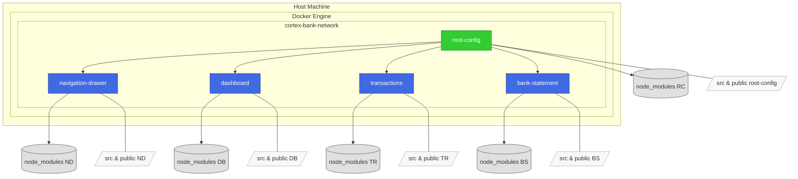

# Diagrama Arquitetural Docker (Microfrontends + Root Config)

```mermaid
graph TD;

    subgraph Host[Host Machine]
        subgraph Docker[Docker Engine]

            subgraph NET[cortex-bank-network]

                RC[root-config]
                ND[navigation-drawer]
                DB[dashboard]
                TR[transactions]
                BS[bank-statement]

            end
        end
    end

    %% Rotas do root-config
    RC --> ND
    RC --> DB
    RC --> TR
    RC --> BS

    %% Volumes
    ND --> V1[(node_modules ND)]
    DB --> V2[(node_modules DB)]
    TR --> V3[(node_modules TR)]
    BS --> V4[(node_modules BS)]
    RC --> V5[(node_modules RC)]

    %% Relacionamento com diretórios locais (sombras)
    ND --- L1[/src & public ND/]
    DB --- L2[/src & public DB/]
    TR --- L3[/src & public TR/]
    BS --- L4[/src & public BS/]
    RC --- L5[/src & public root-config/]

    classDef mf color:#fff,fill:#4169E1,stroke:#27408B;
    classDef rc color:#fff,fill:#32CD32,stroke:#228B22;
    classDef vol fill:#E0E0E0,stroke:#555;
    classDef local fill:#F8F8F8,stroke:#aaa;

    class ND,DB,TR,BS mf;
    class RC rc;
    class V1,V2,V3,V4,V5 vol;
    class L1,L2,L3,L4,L5 local;
```

